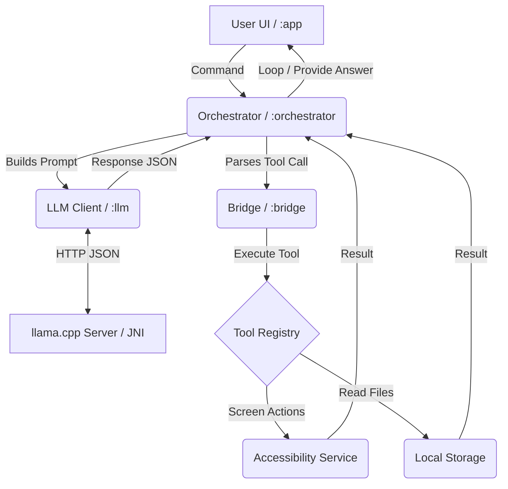

# DroidClaw Architecture

This document describes the high-level architecture of DroidClaw, an autonomous on-device AI agent for Android.

## System Overview

DroidClaw consists of five primary modules designed to separate the user interface, the agent loop, the device bridge, and the underlying local LLM execution.

1.  **:app** - The Jetpack Compose User Interface. Contains the Dashboard, Model Downloader, and Chat/Log screens.
2.  **:orchestrator** - The "Brain." It manages the `AgentLoopService`, prompt generation, tool parsing, and state machine (idle, thinking, executing, errored).
3.  **:bridge** - The "Hands and Eyes." It contains the `ToolRegistry` and specific tools (e.g., `ToolTapElement`, `ToolSwipe`, `ToolFileRead`). Most importantly, it connects to the `AccessibilityService` and `NotificationListenerService` to interact with the device.
4.  **:core** - Shared domain models, states, and utility functions used across all modules.
5.  **:llm** - The "Engine." This module wraps the incredible `llama.cpp` project. It contains the JNI bindings, the statically compiled `libllama-server.so` binary, and the client code to communicate with the local server over HTTP.

## The Agent Loop

The core flow of DroidClaw execution in the `:orchestrator` follows this loop:

1.  **Trigger:** User issues a natural language command (e.g., "Change my wallpaper").
2.  **Context Assembly:** The `AgentLoopService` builds the current context, including the system prompt and available tools from the `ToolRegistry`.
3.  **Inference:** The context is sent to the local `llama.cpp` server via the `:llm` module.
4.  **Parse Response:** The LLM returns a structured JSON response (dictated by the system prompt).
5.  **Execution (Bridge):** If the LLM chooses to use a tool, the request is parsed and executed by the `NativeToolExecutor` via the `ToolRegistry` in the `:bridge` module.
6.  **Observation:** The result of the tool execution (e.g., "Screen tapped", or "Error: element not found") is fed back into the conversation history.
7.  **Loop:** The loop repeats (Inference -> Execute -> Observe) until the LLM decides the task is complete and returns a final answer to the user.

## Tool Registry and Accessibility

The `:bridge` module is crucial because it allows the agent to break out of the sandbox.

*   **`ToolRegistry`**: A central repository mapping tool names to tool classes.
*   **Accessibility Service**: Tools like `ToolTapElement` rely on the `DroidClawAccessibilityService`. This service allows the app to perform global actions (swipe, home, back) and dispatch custom gestures to click specific `(X, Y)` coordinates that the LLM has deduced.
*   **Safety**: All tools implement `BaseTool`, which standardizes parameter parsing, execution logic, and error handling so the LLM receives consistent feedback even if a tool fails.

## Data Flow Diagram

## Future Architecture Goals

-   **Vision-Language Models (VLMs)**: Integrating VLMs directly into `llama.cpp` to analyze screenshots instead of relying solely on accessibility nodes.
-   **Persistent Memory**: Moving beyond in-memory chat histories to a local SQLite database for long-term agent memory.
-   **Plugin Architecture**: Allowing users to dynamically load new tools down the road.
